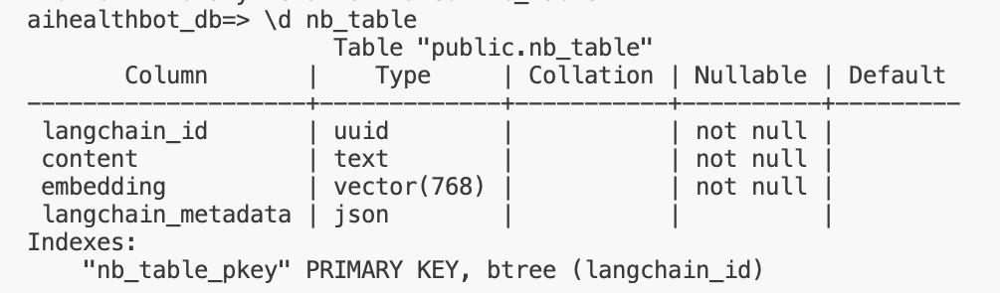

# 🏥 AIHealthBot - Chatbot Médical avec RAG & Cloud SQL 🚀

AIHealthBot est un chatbot médical intelligent basé sur **LangChain**, **Vertex AI** et **PostgreSQL**.  
Il utilise un système **RAG (Retrieval-Augmented Generation)** pour fournir des réponses médicales précises à partir d'une base de données vectorielle.

---
## 📚 Données utilisées

Les données proviennent du dataset **[LayoutLM Medical Dataset](https://www.kaggle.com/datasets/jpmiller/layoutlm/data)** disponible sur Kaggle.  
Ce dataset contient un ensemble structuré de **questions médicales** associées à des **réponses**, **sources** et **catégories médicales**.

### 📌 Chaque donnée comprend :
- 📝 **Une question médicale** formulée par un utilisateur.
- 💡 **Une réponse** issue de sources médicales fiables.
- 📌 **Une source** scientifique ou institutionnelle validée (ex : **NIH, OMS**).
- 🧠 **Un focus médical** qui catégorise la question (ex : **Cardiologie, Neurologie, Diabète**).

---
## ✨ Fonctionnalités
- 🔍 **Recherche vectorielle** : Utilisation de `textembedding-gecko@latest` pour retrouver les questions médicales les plus pertinentes.
- 📚 **Base de connaissances** : Intégration avec **PostgreSQL + pgvector** pour stocker les embeddings et métadonnées.
- ⚡ **FastAPI & Streamlit** : API REST pour l’IA + interface utilisateur.
- ☁ **Déploiement Cloud** : Fonctionne avec **Google Cloud SQL & Vertex AI**.

---
## Architecture

- **Base de données :** PostgreSQL sur Google Cloud SQL
- **Embeddings :** Google VertexAI Embeddings
- **LLM :** Gemini 1.5 Pro
- **Frontend :** Streamlit
- **Backend :** FastAPI
- **Déploiement :** Google Cloud Run

---

## Structure du projet 📂

Voici une vue d'ensemble des fichiers et dossiers principaux du projet :

```plaintext
AIHealthBot/
├── downloaded_files/         # Contient le fichier CSV 'medquad.csv' téléchargé depuis le bucket GCS  
├── images/                   # Contient les images pour l'UI
├── .gitignore                # Liste des fichiers ignorés par Git  
├── api.py                    # API FastAPI pour interagir avec l'IA
├── app.py                    # Interface utilisateur (Streamlit) 
├── config.py                 # Configuration des variables Cloud
├── eval.py                   # Script d'évaluation
├── ingest.py                 # Chargement et indexation des données
├── notebook.ipynb            # Notebook
│── README.md                 # Documentation du projet
├── requirements.txt          # Liste des dépendances Python
├── retrieve.py               # Recherche et récupération des documents pertinents
```

## 🛠️ Installation & Configuration

### 🔧 Configuration initiale sur Google Cloud

Avant d’exécuter l’application, assurez-vous de configurer **Google Cloud** en créant les ressources suivantes :

- Créer un bucket Google Cloud Storage (GCS): Le bucket servira à **stocker les fichiers CSV** et autres ressources nécessaires.  

- Créer une instance Cloud SQL

- Créer la base de données connectée à l'instance

### 1️ - **Cloner le projet**
```bash
git clone https://github.com/nadyby/AIHealthBot
cd AIHealthBot
```

### 2 - **Créer un environnement virtuel & installer les dépendances**
```bash
python3 -m venv venv
source venv/bin/activate  # (Windows: venv\Scripts\activate)
pip install -r requirements.txt
```

### 3 - **Configurer la clé API et le mot de passe de la DB Cloud**

   - Créer un fichier `.env` à la racine du projet et y ajouter la clé API et le mot de passe :
     ```ini
     GOOGLE_API_KEY=ta_clé_API
     DB_PASSWORD=yourpassword
     ```
   - Ajouter `.env` au fichier `.gitignore` pour éviter de commettre la clé API et le mot de passe dans le dépôt Git.

### 4 - **Configurer les variables Cloud**

- Créer un fichier `config.py` à la racine du projet et y ajouter les variables Cloud suivantes :
     ```ini
     PROJECT_ID=projectid
     INSTANCE=instancename
     REGION=yourregion
     DATABASE=yourdatabase
     DB_USER=postgresuser
     TABLE_NAME=yourtablename
     BUCKET_NAME=bucketname
     ```

### 5 - **Lancer Cloud SQL Proxy**
```bash
./cloud-sql-proxy --port port projectid:region:instancename
```

### 6 - **Création de table PostgreSQL**
La création de la table contenant les embeddings et métadonnées des questions médicales se trouve dans le notebook du projet (notebook.ipynb).

Exécutez le notebook pour générer automatiquement la table et insérer les données.

Voir l’image ci-dessous pour la structure détaillée de la table SQL : 



## 🚀 Utilisation

### 1 - **Lancer l'API FastAPI**
L'API est développée avec **FastAPI** et permet d'interagir avec l'IA via des requêtes HTTP.

```bash
uvicorn api:app --reload
```
Définir la variable HOST dans app.py.

### 2 - **Lancer l'interface utilisateur (Streamlit)**
```bash
streamlit run app.py
```


## Licence 📜
Ce projet est sous licence **MIT**.